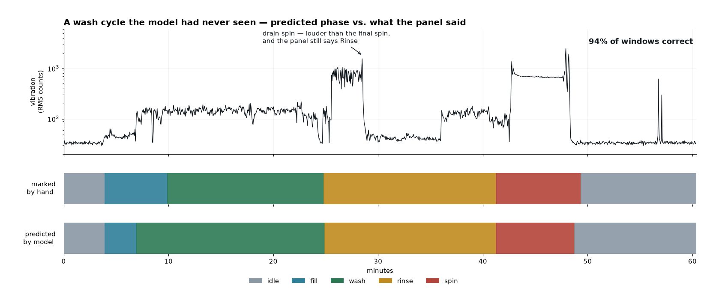
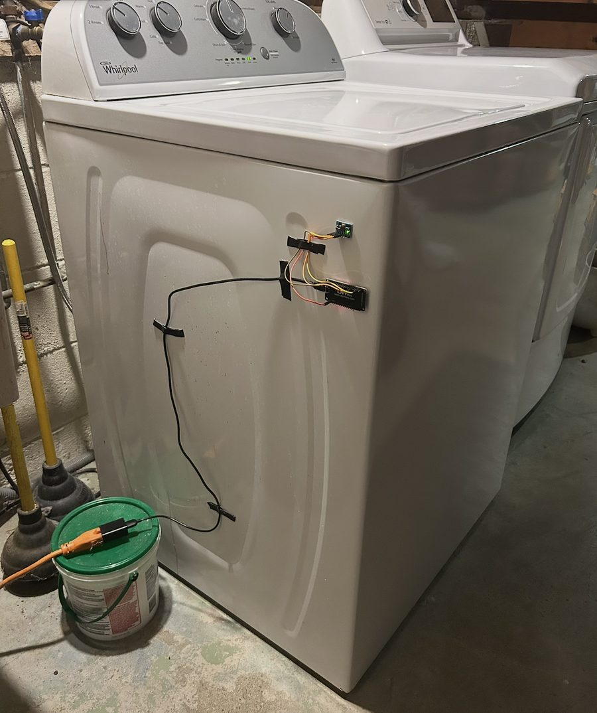

# LaundryWatch


A local-first web app that tells you whether the washer is running (+ which
phase it's in), driven by a taped-on vibration sensor and a learned model of
what each phase of a cycle looks like in the frequency domain.

Runs entirely on your own machine. No cloud, no hosting.



The top bar is what a person marked on the washer's own panel; the bottom is what
the model predicted from vibration alone, on a cycle it had never seen. An ESP32
taped to the machine POSTs accelerometer windows over the LAN, and a FastAPI
service turns each one into a phase and serves the washer's state to a React
dashboard.

## Running it

```bash
python -m venv venv && venv/bin/pip install -r requirements.txt
venv/bin/uvicorn server.main:app --host 0.0.0.0   # dashboard at :8000
```

Record a few cycles from the dashboard, then train on your own washer:

```bash
venv/bin/python analysis/label.py --all   # marks -> labels
venv/bin/python analysis/train.py         # -> models/clf-v1.joblib
venv/bin/python analysis/evaluate.py      # held out by whole cycle
```

## Layout

```
firmware/   MicroPython sampler for the ESP32
pipeline/   features, calibration, classifier, HMM, rule baseline (pure numpy)
server/     FastAPI + SQLite: ingest, cycles, marks, live inference
analysis/   labeling, training, evaluation — the things you run by hand
web/        Vite + React + Tailwind dashboard
tests/      24 tests, mostly against a tone whose answer is known in advance
```

## Picture (see HARDWARE.md for details)

